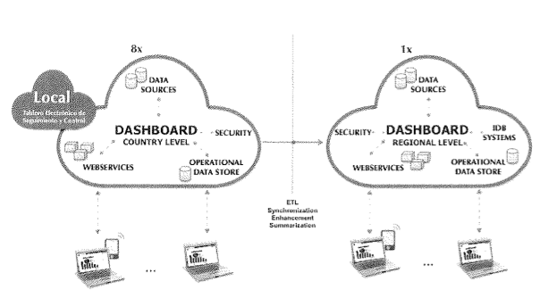

#Descripción del eTAB

El e-TAB es una herramienta que propone proveer información y datos presentando estos de una manera accesible y objetiva, utilizando visualizaciones gráficas de diferentes tipos (gráficas, mapas, tablas interactivas) que buscará distribuir y proveer información de diferentes programas de forma unificada. Inicialmente, basados en necesidades existentes, es necesario un análisis para mejor entendimiento de la ejecución del programa dentro de la iniciativa. Por lo tanto, el eTAB será alimentado por los datos obtenidos a 
partir de la información administraTiva producida por el sistema estatal y 
nacional de información de salud.

El Tablero de Seguimiento y Control en Línea permitirá: 

1. Monitorear el progreso de la ejecución y la utilización de los recursos.
2. Monitorear el progreso hacia el logro de resultados. 
3. Retroalimentar el sistema para tomar medidas correctivas sobre la marcha del proyecto y alinearlo hacia el cumplimiento de los resultados comprometidos. 

La información contenida en el Tablero de Seguimiento, a su vez, alimentará el 
Reporte de Monitoreo del Progreso y Desempeño (PMR), sistema de ìnformación del 
BID y a disposición de la Iniciativa SM2015 y del ISECH, la idea es evitar en 
lo posible la creación de sistemas de información paralelos y más bien fortalecer 
el sistema de información sectorial del ISECH.

El eTAB será desarrollado utilizando un repositorio de código de acceso abierto 
a través de Internet y publicado bajo los términos de una licencia libre/open source [^1].

Las siguiente figura muestra la visión general del DashBoard (eTAB) a nivel país 
(izquierda) y su integración con el DashBoard a nivel regional (derecha), 
dentro del marco de la Iniciativa SM2015.

[^1]: Aprobada por la Free Softwale Foundation y la Open Source Initiative.
